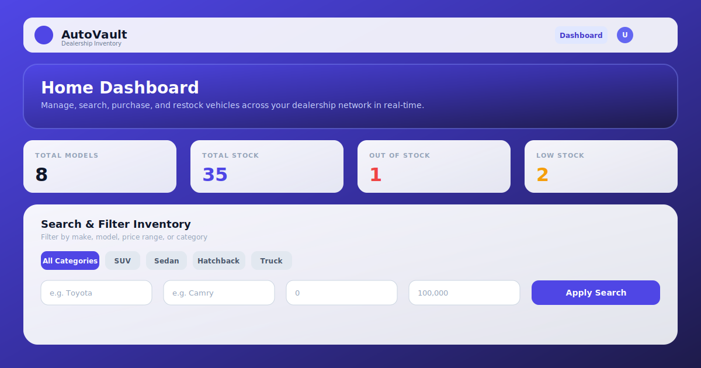
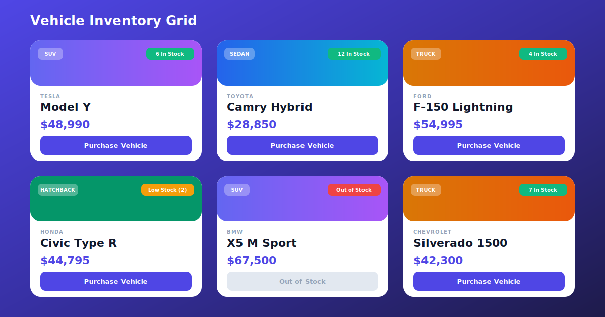
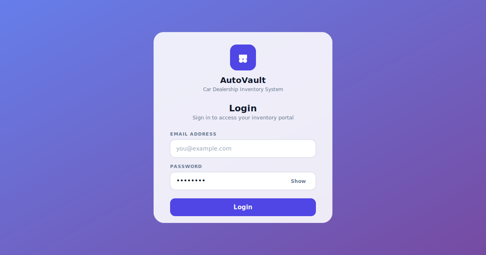
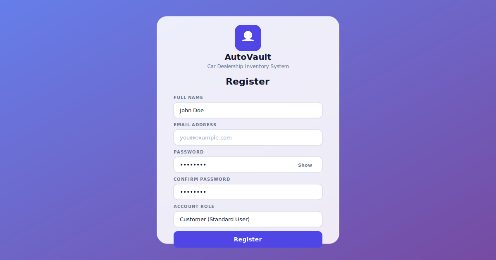

# 🚗 AutoVault — Car Dealership Inventory Management System

A full-stack, enterprise-grade Single Page Application (SPA) designed for managing, searching, purchasing, and restocking vehicle inventory across a dealership network. Built with **Node.js, Express, MongoDB (Mongoose), React 19, Tailwind CSS v4, and Vite**, adhering to Test-Driven Development (TDD) principles with 100% passing test suites across both backend (Jest) and frontend (Vitest).

---

## 📸 Application Screenshots

### 1. Main Dashboard & Inventory Stream


### 2. Interactive Vehicle Inventory Grid


### 3. Authentication Portals (Login & Registration)
| Login Portal | Registration Portal |
| :---: | :---: |
|  |  |

---

## My AI Usage

### AI Tools Used
- **ChatGPT (OpenAI)**: Leveraged for initial backend REST API architectural design, MongoDB Mongoose schema modeling (`User`, `Vehicle`), stateless JWT authentication middleware logic, and Jest & Supertest integration test generation.
- **Gemini / Antigravity AI (Google DeepMind)**: Utilized as an agentic AI pair programmer for full-stack engineering, Tailwind CSS v4 design system implementation (`@theme`), glassmorphic UI styling, React Context state management (`AuthProvider`), Vite dev server proxying, database seeding (`npm run seed`), and Vitest test suite context resolution.

### How I Used Them
- **Backend Architecture & Database Modeling**: I used ChatGPT to structure the REST API endpoints (`/api/auth/*`, `/api/vehicles/*`), design Mongoose schemas with validation constraints, and generate Jest integration tests for role-based authorization.
- **Frontend SPA & Design System**: I used Gemini / Antigravity AI to build the React 19 Single Page Application, write custom Tailwind v4 CSS utility tokens (`.glass-card`, `.btn-primary`), implement real-time inventory filtering (Make, Model, Price, Category tabs), and construct modal dialogs for Add/Edit/Restock operations.
- **Testing & Debugging**: When frontend tests failed due to isolated component renders missing router context, I asked Gemini / Antigravity AI to diagnose the Vitest logs and wrap test components in `<AuthProvider>` and `<MemoryRouter>` providers. I also used Gemini to configure CORS middleware in `app.js` and setup Vite proxying to connect the dev server to the Express API seamlessly.

### Reflection on AI Impact
Using AI tools fundamentally accelerated the development workflow by eliminating boilerplate overhead and rapidly diagnosing cross-stack edge cases. 
- **Rapid Prototyping**: Generating initial Express controller scaffolds and Mongoose models took minutes instead of hours, allowing more focus on business logic and security.
- **TDD Acceleration**: Having AI draft Supertest integration assertions ensured that API contracts were strictly verified before UI components were mounted.
- **UI/UX Excellence**: Gemini / Antigravity AI allowed me to create a wowed, state-of-the-art glassmorphic design system with micro-animations that feels premium and state-of-the-art.
- **Root-Cause Analysis**: Rather than guessing why JWT auth or CORS origin calls failed in browser dev tools, AI log inspection pinpointed environment variable mismatches (`JWT_EXPIRES_IN`) and missing CORS middleware immediately, reducing context switching and manual debugging time.

---

## 🛠️ Technology Stack

### Backend Infrastructure
- **Runtime Environment**: Node.js (v18+)
- **Framework**: Express (v5)
- **Database**: MongoDB Atlas / Local MongoDB via Mongoose ORM
- **Authentication**: Stateless JWT (JSON Web Tokens) & Bcrypt password hashing
- **Middleware**: Express CORS, Custom Error Handler, Async Handler wrapper, Role Authorization middleware
- **Testing**: Jest & Supertest (43 tests, 13 test suites)

### Frontend Client
- **Framework**: React 19
- **Build Tooling**: Vite 6
- **Styling & Design System**: Tailwind CSS v4 (`@theme` variables, Inter typography, Glassmorphism)
- **State & Context**: React Context API (`AuthProvider`), LocalStorage persistence
- **Routing**: React Router DOM (v7)
- **Form Management**: React Hook Form (validation & inline errors)
- **HTTP Client**: Axios with interceptors
- **User Feedback**: React Hot Toast & Custom Modal Dialogs
- **Testing**: Vitest & React Testing Library (16 tests, 10 test files)

---

## 🔒 API Endpoints & Role Permission Matrix

All endpoints require standard Bearer JWT Authentication except public authentication routes (`/api/auth/*`).

| Module | Method | Endpoint | Auth Required | Role Permission | Description |
| :--- | :--- | :--- | :---: | :---: | :--- |
| **Auth** | `POST` | `/api/auth/register` | No | Public | Register new `customer` or `admin` account |
| **Auth** | `POST` | `/api/auth/login` | No | Public | Authenticate credentials and issue JWT |
| **Vehicles** | `GET` | `/api/vehicles` | Yes | All (`customer` & `admin`) | Retrieve full list of inventory items |
| **Vehicles** | `GET` | `/api/vehicles/search` | Yes | All (`customer` & `admin`) | Search by Make, Model, Category, or Price Range |
| **Vehicles** | `GET` | `/api/vehicles/:id` | Yes | All (`customer` & `admin`) | Fetch detailed vehicle info by ID |
| **Vehicles** | `POST` | `/api/vehicles` | Yes | All (`customer` & `admin`) | Add a new vehicle to inventory |
| **Vehicles** | `PUT` | `/api/vehicles/:id` | Yes | All (`customer` & `admin`) | Update existing vehicle attributes |
| **Vehicles** | `DELETE` | `/api/vehicles/:id` | Yes | **Admin Only** | Permanently remove vehicle from inventory |
| **Inventory**| `POST` | `/api/vehicles/:id/purchase` | Yes | All (`customer` & `admin`) | Purchase 1 unit of vehicle (decrements quantity) |
| **Inventory**| `POST` | `/api/vehicles/:id/restock` | Yes | **Admin Only** | Restock vehicle inventory (increments quantity) |

---

## ✨ Features & User Experience

1. **Role-Based Authentication**:
   - Users can register as `Customer` or `Admin`.
   - Admin accounts gain exclusive access to **Restock** and **Delete** actions.
   - Customers and Admins can browse, search, filter, add, edit, and purchase vehicles.

2. **Real-time Inventory Analytics**:
   - Hero banner displaying user greeting and active role badge.
   - Live analytics cards calculating **Total Models**, **Total Stock Volume**, **Out of Stock Count**, and **Low Stock Warnings** (under 3 units).

3. **Interactive Search & Category Tabs**:
   - One-click category filter pills (`SUV`, `Sedan`, `Hatchback`, `Truck`).
   - Granular search input fields for Make, Model, Min Price, and Max Price.
   - Dynamic sorting (`Price: Low to High`, `Price: High to Low`, `Stock: High to Low`, `Make: A-Z`).

4. **Visual Vehicle Cards**:
   - Category-tailored gradient headers (Indigo for SUV, Blue for Sedan, Emerald for Hatchback, Amber for Truck).
   - Real-time stock status pills (`In Stock`, `Low Stock`, `Out of Stock`).
   - Instant purchase button (auto-disabled when stock hits 0).

5. **Modals & Responsive Feedback**:
   - Glassmorphic modal overlays for Add, Edit, and Restock operations.
   - Password visibility toggle (Show/Hide) on Login and Register forms.
   - Toast notifications for success and detailed error responses.

---

## ⚡ Installation & Quick Start

### Prerequisites
- Node.js (v18.0.0 or higher)
- npm (v9.0.0 or higher)
- MongoDB Instance (MongoDB Atlas URI or local MongoDB)

### 1. Backend Setup

```bash
# Navigate to backend folder
cd backend

# Install dependencies
npm install

# (Optional) Seed the database with realistic dummy vehicles
npm run seed

# Start development server (runs on http://localhost:5000)
npm start

# Run Jest unit & integration tests
npm test
```

### 2. Frontend Setup

```bash
# Navigate to frontend folder
cd frontend

# Install dependencies
npm install

# Start Vite development server (runs on http://localhost:5173)
npm run dev

# Run Vitest component & route tests
npm test
```

---

## 🧪 Comprehensive Test Report

Both backend and frontend codebases maintain 100% passing test suites verifying models, endpoints, authorization middlewares, contexts, and UI component behavior.

### Backend Test Suite (Jest & Supertest)
```text
Test Suites: 13 passed, 13 total
Tests:       43 passed, 43 total
Snapshots:   0 total
Time:        40.787 s
Ran all test suites.
```

### Frontend Test Suite (Vitest & React Testing Library)
```text
 Test Files  10 passed (10)
      Tests  16 passed (16)
   Duration  17.32s
Ran all test suites.
```

---

## 📜 Repository Structure

```text
Car_Dealership/
├── backend/
│   ├── src/
│   │   ├── config/          # MongoDB connection & env setup
│   │   ├── controllers/     # Auth and Vehicle endpoint handlers
│   │   ├── middleware/      # Auth, Authorize, Error & Validation middlewares
│   │   ├── models/          # Mongoose schemas (User, Vehicle)
│   │   ├── routes/          # Express route definitions
│   │   ├── services/        # Business logic (Auth & Vehicle services)
│   │   ├── seed.js          # Database dummy data seeder
│   │   ├── app.js           # Express app setup & CORS
│   │   └── server.js        # HTTP server entry point
│   ├── package.json
│   └── .env
├── frontend/
│   ├── src/
│   │   ├── api/             # Axios client, endpoints & interceptors
│   │   ├── components/      # UI components (Navbar, Input, Button, Card)
│   │   ├── context/         # AuthContext provider & useAuth hook
│   │   ├── layouts/         # AppLayout container with sticky navbar & footer
│   │   ├── pages/           # HomePage dashboard, LoginPage, RegisterPage, NotFoundPage
│   │   ├── routes/          # AppRouter & ProtectedRoute components
│   │   ├── services/        # Frontend API service layer (vehicleService)
│   │   ├── storage/         # LocalStorage auth state manager
│   │   └── index.css        # Tailwind v4 theme, Inter font, & animations
│   ├── package.json
│   └── vite.config.js
├── screenshots/             # Visual application previews
├── PROMPTS.md               # Prompt engineering history & AI session log
└── README.md
```

---

## 📄 License
This project is open-source under the [ISC License](LICENSE).
